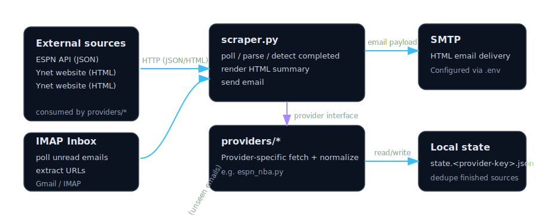

# Web Scraper Agent

A Python agent that continuously scrapes data from multiple pluggable web providers, detects new/completed items, and emails a summary table.

## Features

- Pluggable provider system for scraping data from multiple sources via `providers/*`
- Fetches data from provider sources (API JSON / HTML)
- Detects newly-completed items and filters out previously notified/rejected ones
- Tracks state between checks using a local `state.<provider-key>.json` file
- Sends HTML email summaries when new items are detected

## Architecture



## Quick Start (WSL)

```bash
# 1. Navigate to the project
cd /mnt/c/Projects/python/Scraper

# 2. Make scripts executable & run setup
chmod +x setup.sh run.sh
./setup.sh

# 3. Edit .env with your SMTP credentials
nano .env

# 4. Run the agent
./run.sh          # continuous loop (default: every 5 minutes)
./run.sh once     # single check
```

## Docker

Helper scripts for building and running the agent in a container are in `docker/`.

```bash
# Build locally (creates image: scraper:latest)
./docker/build-and-push.sh

# Run locally (persists state in a named Docker volume)
./docker/deploy.sh

# Run a single scrape cycle
./docker/deploy.sh once
```

```bash
# Deploy from Docker Hub instead of building locally
./docker/deploy.sh --dockerhub

# Use a different env file (default: .env at repo root)
ENV_FILE=.env ./docker/deploy.sh
```
